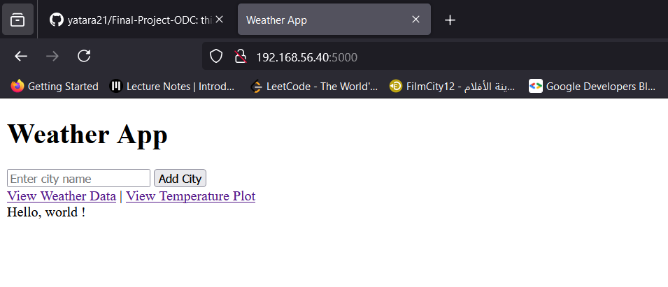
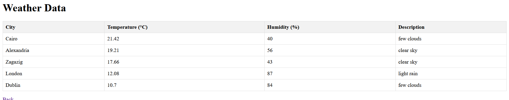
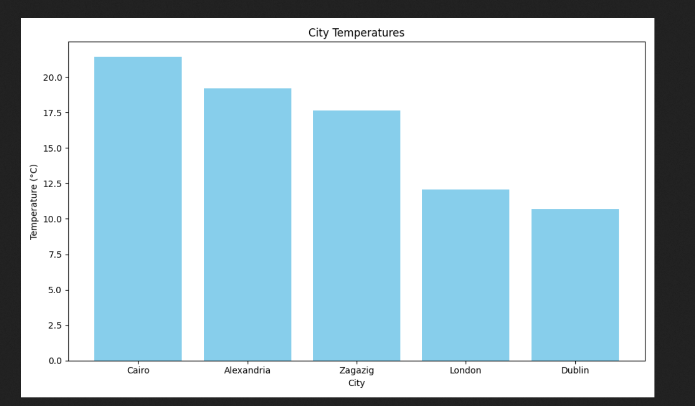
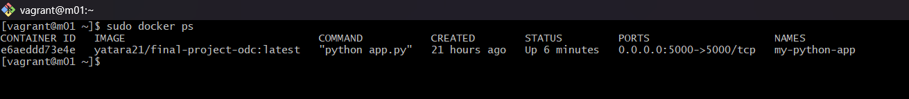
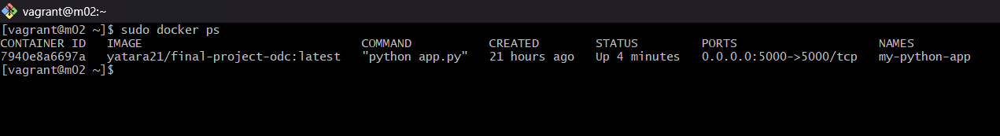
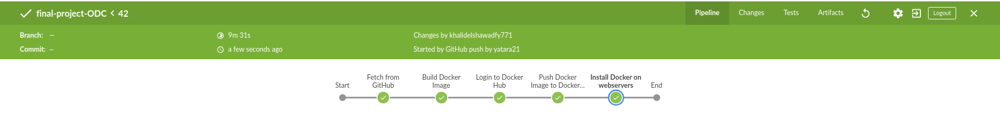
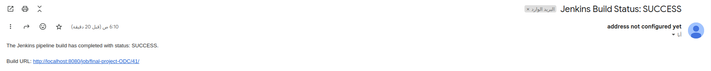

# Final Project of the DevOps Program by , 


This project outlines a workflow to build and deploy a simple web application using a CI/CD pipeline and modern DevOps tools, including Docker, Jenkins, Ansible, and Vagrant. The objective is to automate the end-to-end process of application development, containerization, deployment, and execution on target machines.


## Table of Contents :heavy_check_mark:

1. [Project Overview](#project-overview)
2. [Objective and Benefits](#Objective-and-Benefits)
3. [Features](#features)
4. [Screenshots](#Screenshots)
5. [Project Structure](#project-structure)
6. [Setup and Installation](#setup-and-installation)
7. [Continuous Integration with Jenkins](#continuous-integration-with-jenkins)
8. [Configuration Management with Ansible](#configuration-management-with-ansible)


## Project Overview :heavy_check_mark:

The project demonstrates a complete DevOps pipeline that integrates Python, Docker, Jenkins, and Ansible to streamline the development, deployment, and automation of applications. It provides a modern template for implementing DevOps best practices by focusing on Automation using Jenkins Pipeline, Dockerization , Configuartions Management using Ansible and Reliability


## Objective and Benefits :heavy_check_mark:

- **Automation**: Eliminates manual steps, reducing errors and improving efficiency.
- **Portability**: Containerized application ensures consistent behavior across environments.
- **Scalability**: Demonstrates deployment to multiple target machines, a scalable setup for real-world use.
- **Learning Opportunity**: Provides hands-on experience with key DevOps tools and practices.


## Features :heavy_check_mark:

- **Dockerized Application**: Ensures compatibility across different environments and platforms. 
- **Automated CI/CD Pipeline**: Utilizes Jenkins to build, test, and deploy applications efficiently. 
- **Infrastructure as Code (IaC)**: Employs Ansible to streamline environment setup and deployment. 
- **Customizable Templates**: Offers flexibility for adapting to various project requirements.
- **Automatic Rebuild**: Jenkins pipeline automatically triggers rebuilds whenever new code is pushed to the GitHub repository. 
- **Automatic Email Notifications**: Automatically sends the status of the build to the system administrator using the `Sendmail` package. 

## Screenshots

1. **Accessing our Application**  
   

2. **Retrieving Data from Open Weather**  
   

3. **Our Data as a Diagram**  
   


## Project Structure :heavy_check_mark:

```
Final-Project-ODC/
├── app.py              # Core Python application file
├── Dockerfile          # Configuration for Docker image creation
├── jenkinsfile         # Script defining Jenkins pipeline stages
├── playbook.yml        # Ansible playbook for automating deployments
├── requirements.txt    # Python library dependencies
├── inventory           # List of target hosts for Ansible
└── templates/          # Template files used by Ansible for configuration
```

## Setup and Installation :heavy_check_mark:
Follow the steps below to set up and run this project locally or on your server.

1. **Clone the Repository**: Start by cloning the GitHub repository to your local machine or server
```
git clone https://github.com/yatara21/Final-Project-ODC.git
cd Final-Project-ODC
```
2. **Install Required Software**: Ensure the following tools are installed on your system:
   - **Docker**: For building and running the application in a container.
   - **Ansible**: For automating the deployment and configuration on web servers.
   - **Python 3.x**: Required to run the application.
   - **Jenkins**: To automate the CI/CD pipeline (if you want to use Jenkins for integration).
   - **Sendmail**: To send the status of your Build. 
   - **Ngrok**: To expose your Jenkins server to the Public Internet.

3. **Install Python Dependencies**: This project requires certain Python libraries. Install them using the `requirements.txt` file:
```
pip install -r requirements.txt
```

4. **Set Up Docker and Jenkins (Optional)**:

   :green_circle: 4.1 **Build the Docker Image**: To build the Docker image for the application
   ```
   docker build -t yatara21/final-project-odc .
   ```
     :green_circle: 4.2 **Run the Docker Container**: To run the application in a Docker container on your local machine
   ```
   docker run -p 5000:5000 yatara21/final-project-odc:latest
   ```
5. **Configure and Run Ansible Playbook**:
   You can use the Ansible playbook to deploy the application on your web servers.
   
     :green_circle: 5.1 **Edit Ansible Inventory File**:
   Ensure the `inventory` file contains the correct target web servers where you want to deploy the application.
   
      Example:
   ```
   [webservers]
   your-server-ip
   ```
     :green_circle: 5.2 **Run the Playbook**:
   Run the Ansible playbook to install Docker, pull the latest Docker image, and deploy the container:
   ```
   ansible-playbook -i inventory playbook.yml
   ```
   This will ensure that the required dependencies are installed on your web server, and the Docker container is running with the latest image.

6. **Set Up Jenkins (Optional)**: If you want to automate the build, test, and deployment process using Jenkins, follow these steps:

   - Create a new Jenkins Pipeline.
   
   - Add the `Jenkinsfile` from the project repository.

   - Set up the necessary credentials in Jenkins for GitHub and Docker Hub (as specified in the `Jenkinsfile`).

   - Run the Jenkins Pipeline to automatically fetch the code, build the Docker image, test, push to Docker Hub, and deploy to the web servers.

   - Access the Application

   After the deployment is complete, the application should be accessible at `http://<your-web-server-ip>:5000`.





## Continuous Integration with Jenkins

The Jenkins integration automates the CI/CD process for building, and deploying applications. The pipeline, defined in the `jenkinsfile`, handles stages like code fetching, Docker image building, logging into Docker Hub, pushing the image, and deploying the application to web servers using Ansible.





1. **Fetch from GitHub**: 

   This stage pulls the latest code from the specified GitHub repository using the   credentials defined in the environment variables.

```groovy
stage('Fetch from GitHub') {
    steps {
        git branch: 'main', 
            url: "${GITHUB_REPO}", 
            credentialsId: "${GITHUB_CREDENTIALS}"
    }
}
```


2. **Build Docker Image**: 

   This stage builds the Docker image based on the code fetched from the repository.

```groovy
stage('Build Docker Image') {
    steps {
        sh 'docker build -t $DOCKER_IMAGE:$DOCKER_TAG .'
    }
}
```
- **Purpose**: Builds a Docker image from the Dockerfile in the repository.
- **Explanation**: The `docker build` command uses the Dockerfile in the current directory (`.`) and tags the image with the specified `$DOCKER_IMAGE:$DOCKER_TAG.`


3. **Login to Docker Hub**: 

   This stage logs into Docker Hub using credentials stored in Jenkins.

```groovy
stage('Login to Docker Hub') {
    steps {
        script {
            withCredentials([usernamePassword(
                credentialsId: "${DOCKER_HUB_CREDENTIALS}", 
                usernameVariable: 'DOCKER_USER', 
                passwordVariable: 'DOCKER_PASS'
            )]) {
                sh 'echo $DOCKER_PASS | docker login -u $DOCKER_USER --password-stdin'
            }
        }
    }
}

```
- **Purpose**: Authenticates Jenkins with Docker Hub to allow pushing the Docker image to a repository.
- **Explanation**: Uses the `withCredentials` block to securely inject Docker Hub credentials into the environment, which are then used to log in using `docker login`.

4. **Push Docker Image to Docker Hub**: 

   This stage tags the Docker image and pushes it to Docker Hub.

```groovy
stage('Push Docker Image to Docker Hub') {
    steps {
        sh 'docker tag $DOCKER_IMAGE:$DOCKER_TAG $DOCKER_HUB_REPO:$DOCKER_TAG'
        sh 'docker push $DOCKER_HUB_REPO:$DOCKER_TAG'
    }
}
```
- **Purpose**: Tags the built Docker image and uploads it to the Docker Hub repository.
- **Explanation**: First, the image is tagged with the `DOCKER_HUB_REPO:$DOCKER_TAG`, and then it is pushed to the repository using the `docker push` command.

5. **Install Docker on Webservers**: 

   This stage uses Ansible to install Docker and deploy the application on the web servers.

```groovy
stage('Install Docker on webservers') {
    steps {
        script {
            sh "ansible-playbook -i $ANSIBLE_INVENTORY $ANSIBLE_PLAYBOOK"
        }
    }
}
```
- **Purpose**: Deploys the Docker container to remote web servers using Ansible.
- **Explanation**: Runs the Ansible playbook (`playbook.yml`) on the target web servers listed in the `inventory file`. The playbook ensures that Docker is installed and the latest container is deployed.

6. **Post Build Actions**: 

   This block sends an email notification with the status of the Jenkins build.





```groovy
post {
    always {
        emailext(
            subject: "Jenkins Build Status: ${currentBuild.result}",
            body: "The Jenkins pipeline build has completed with status: ${currentBuild.result}.\n\nBuild URL: ${env.BUILD_URL}",
            to: "${EMAIL_RECIPIENT}"
        )
    }
}
```
- **Purpose**: Sends an email notification to the recipient regardless of whether the build succeeds or fails.
- **Explanation**: The `emailext` function sends an email with the build result and a link to the build URL. The email is sent to the address specified in `EMAIL_RECIPIENT`.

### Summary of Each Stage:

1. **Fetch Code from GitHub**: Fetches the latest code from the specified GitHub repository.
2. **Build Docker Image**: Builds a Docker image from the fetched code.
3. **Login to Docker Hub**: Logs into Docker Hub using provided credentials.
4. **Push Docker Image to Docker Hub**: Tags and pushes the Docker image to Docker Hub.
5. **Install Docker on Webservers**: Deploys the application to web servers using Ansible.
6. **Post Build Actions**: Sends an email notification with the status of the build.


## Configuration Management with Ansible :heavy_check_mark: :memo:

This playbook automates the deployment of a Dockerized Python application on web servers. It ensures required dependencies and Docker are installed, stops and removes any existing containers, pulls the latest Docker image from Docker Hub, and starts a new container.
```groovy
---
- name: Deploy Docker Application on webservers
  hosts: webservers
  become: yes

  tasks:
    - name: Install dependencies and Docker
      yum:
        name:
          - yum-utils
          - device-mapper-persistent-data
          - lvm2
          - python3
          - python3-pip
          - docker-ce
        state: present

    - name: Ensure Docker service is running
      service:
        name: docker
        state: started
        enabled: yes

    - name: Manage existing Docker container
      block:
        - name: Stop and remove container if running
          docker_container:
            name: "my-python-app"
            state: absent
          when: container_info.container is defined

    - name: Pull latest Docker image
      docker_image:
        name: "your-username/your-repo"
        tag: "latest"
        source: pull

    - name: Run Docker container
      docker_container:
        name: "my-python-app"
        image: "your-username/your-repo:latest"
        state: started
        restart_policy: always
        ports:
          - "5000:5000"
        detach: yes
```
### Summary of Key Tasks: 

- **Install Dependencies**: Installs required packages and Docker.
- **Ensure Docker Service**: Starts and enables Docker.
- **Manage Containers**: Stops and removes any existing container.
- **Pull Docker Image**: Fetches the latest image from Docker Hub.
- **Run Docker Container**: Deploys the updated container with the application. 

### Running the Playbook

Execute the following command to deploy the application:

```bash
ansible-playbook -i inventory playbook.yml
```

This command will:

- Provision the required infrastructure.
- Configure dependencies and runtime environments.
- Deploy the latest version of the application.

### *Monitoring and Debugging*

- Use the `-vvv` flag for verbose output when running playbooks:
  ```bash
  ansible-playbook -i inventory playbook.yml -vvv
  ```
- Check logs for detailed error messages and task execution details.

## Conclusion :heavy_check_mark:
This project demonstrates a streamlined DevOps workflow, integrating modern tools and best practices to achieve efficient, scalable, and automated application deployment. It serves as a robust foundation for building and deploying production-grade applications.

## Future Enhancements :heavy_check_mark:
- Add monitoring and logging with Prometheus and Grafana.
- Support for Kubernetes-based deployments.
- Integrate security testing into the CI/CD pipeline.


## Troubleshooting :heavy_check_mark:
- **Docker Build Fails**: Ensure Docker is installed and running on your system.
- **Jenkins Authentication Error**: Check that your GitHub personal access token is correctly configured in Jenkins credentials.


## Contact  :heavy_check_mark:
For any inquiries or feedback, please contact:
- **Name**: Khalid Nada
- **Email**: khalidelshawadfy771@gmail.com
- **GitHub**: https://github.com/yatara21


